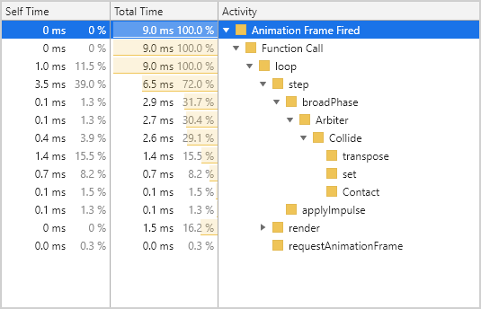

# Box2D Lite TypeScript

This is a port of Erin Catto's [Box2D Lite](https://github.com/erincatto/box2d-lite) to TypeScript.


## v0.0.1

All classes ported. Test bed created. Everything runs, but it's generating a staggering number of vec2 and mat22 instances per frame. Currently, the test is creating 274,000 vec2s and 37,000 mat22s per frame at 20 world iterations. This needs sorting. Inline math to the rescue.

20 world iterations:

```
Frame: 200 = 201,806 vec2s - 36,926 mat22s
Frame: 600 = 274,009 vec2s - 37,007 mat22s
```

10 world iterations:

```
Frame: 200 = 190,846 vec2s - 36,929 mat22s
Frame: 600 = 226,913 vec2s - 37,007 mat22s
```

All tests from now will use 10 iterations.

Note that the totals are how many _brand new_ vec2 and mat22 instances are created
in that one single frame. I.e. used purely for collision math.

Why frames 200 and 600? Because in Frame 200 most of the bodies are in the air, the only contacts are with each other or the pendulum. By Frame 600 they're all resting on the floor, so have lots of contacts.

Here is a performance monitor flamechart capture of a single frame (frame 200):


As you can see, we're already over our frame budget at 18.8ms (53fps) and the heap space fluctuates wildly. The callstack isn't much better:


We've a lot of work to be done tidying this up.

## v0.0.2

Inlined all of the Mat22 static functions.

```
Frame: 200 = 64,448 vec2s - 36,933 mat22s
Frame: 600 = 97,684 vec2s - 36,999 mat22s
```

Much better! That's a 66.2304% decrease on Frame 200 in vec2s. The mat22s still fluctate per frame, though. The more contacts, the more there are, so clearly we need to look at the Collision function soon.

## v0.0.3

ComputeIncidentEdge clipVertex inline:

```
Frame: 200 = 64,224 vec2s - 36,933 mat22s
Frame: 600 = 97,196 vec2s - 36,999 mat22s
```

Barely any change, just a 0.347567% decrease.

## v0.0.4

ComputeIncidentEdge n / abs n inline:

```
Frame: 200 = 64,112 vec2s - 36,877 mat22s
Frame: 600 = 96,952 vec2s - 36,877 mat22s
```

Another really minor gain at a 0.17439% decrease.

## v0.0.5

Inline mat22 and vec2s in CanvasRenderer:

```
Frame: 200 = 62,460 vec2s - 36,772 mat22s
Frame: 600 = 95,300 vec2s - 36,772 mat22s
```

Getting there. The renderer really shouldn't add anything! And now it doesn't. A 2.57674% decrease.

## v0.0.6

Let's break-down which part of the `World.step` is causing the most creations:

| Step                                 | vec2 - frame 200 | vec 2 - frame 600 | mat22 - frame 200 &amp; 600 |
|--------------------------------------|------------------|-------------------|-----------------------------|
| World.broadphase                     | 48,065           | 49,225            | 36,764                      |
| Integrate forces                     | 48,368           | 49,528            | 36,764                      |
| Arbiters preStep                     | 48,928           | 51,368            | 36,764                      |
| Joints preStep                       | 48,937           | 51,377            | 36,772                      |
| Perform aribter and joint iterations | 62,357           | 95,197            | 36,772                      |
| Integrate velocities                 | 62,460           | 95,300            | 36,772                      |

So, for vec2s the majority happen in `World.broadphase` and then a massive jump when performing arbiter and joint iterations.

For mat22s everything pretty much happens in `World.broadphase`.

Let's try and reduce the number of vec2s created during arbiter iterations by inlining a bunch of that math.

## v0.0.7

Inlined all vector math in `Arbiter.applyImpulse` and found some duplicate code:

```
Frame: 200 = 50,210 vec2s - 36,772 mat22s
Frame: 600 = 53,998 vec2s - 36,772 mat22s
```

This is a 19.6126% decrease on Frame 200 and a massive 43.3389% decrease on Frame 600. Lovely.

Let's check our `World.step` stats again:

| Step                                 | vec2 - frame 200 | vec 2 - frame 600 |
|--------------------------------------|------------------|-------------------|
| World.broadphase                     | 48,163           | 49,287            |
| Integrate forces                     | 48,466           | 49,590            |
| Arbiters preStep                     | 49,138           | 51,446            |
| Joints preStep                       | 49,147           | 51,455            |
| Perform aribter and joint iterations | 50,107           | 53,895            |
| Integrate velocities                 | 62,460           | 53,998            |

At this stage, it doesn't matter if the bodies are in contact or not, we're getting a much more steady count.

## v0.0.8

When the test starts-up there are 533 vec2 instances and 7 mat22 instances, this is before the World has even stepped once, so it's just what the bodies, joints, etc need to exist.

`World.broadphase` is clearly the biggest cost here because of the Collide function.

It creates 4 new vec2s _per_ Contact instance. Let's see if we can get that lower.

Ok, after replacing the Contact vec2s with numbers and inlining a load of Arbiter math, we've got:

```
Frame: 200 = 48,236 vec2s - 36,772 mat22s
Frame: 600 = 48,666 vec2s - 36,772 mat22s
```

This is a 3.93149% decrease on Frame 200 and 9.87444% decrease on Frame 600.

## v0.0.9

Have gone through the Collide function and used a set of 7 locally cached Mat22 instances and added a few modifier functions that operate on existing instances. Also cached all vec2 instances in the same function. The end result speaks for itself:

```
Frame: 200 = 684 vec2s - 8 mat22s
Frame: 600 = 866 vec2s - 8 mat22s
```

This is a 98.582% decrease on Frame 200 and 98.2205% decrease on Frame 600 for vec2s, and a huge 99.9782% decrease for the mat22s :)

Pretty happy with just 8 mat22s in the entire test! We're still creating ~700 vec2s per frame, though. That is well within an acceptable range, but it'd be good to see if we can push this any further down.

## v0.1.0

It would appear that the final bastion is the `ClipVertex` class. It only creates one vec2 instance per class, but we can still do away with it perfectly easily, with minimal changes elsewhere. Let's go...

```
Frame: 200 = 535 vec2s - 8 mat22s
Frame: 600 = 535 vec2s - 8 mat22s
```

We've now got the vec2 instance count perfectly stable, regardless of the number of contacts, which is great.

Also, a 38.2217% decrease is pretty good. But, I'm sure we can go further without mangling the code too much.

## v0.2.0

Let's check to see where these instances are coming from in the `World.step` again:

| Step                                 | vec2 - frame 200 &amp; 600 |
|--------------------------------------|----------------------------|
| World.broadphase                     | 0                          |
| Integrate forces                     | 303                        |
| Arbiters preStep                     | 303                        |
| Joints preStep                       | 312                        |
| Perform aribter and joint iterations | 432                        |
| Integrate velocities                 | 535                        |

Both Frames 200 and 600 are identical now.

Clearly, the biggest jump is from the integration of the forces. We also get another jump from joints. I've not touched the Joints class yet, so this isn't surprising. Let's inline the forces first, we could probably use a few cache vars in the World class to achieve this.

After inling the force integration on the bodies:

| Step                                 | vec2 - frame 200 &amp; 600 |
|--------------------------------------|----------------------------|
| World.broadphase                     | 0                          |
| Integrate forces                     | 0                          |
| Arbiters preStep                     | 0                          |
| Joints preStep                       | 9                          |
| Perform aribter and joint iterations | 129                        |
| Integrate velocities                 | 232                        |

Perfect, let's do the same for the velocity integration:

| Step                                 | vec2 - frame 200 &amp; 600 |
|--------------------------------------|----------------------------|
| World.broadphase                     | 0                          |
| Integrate forces                     | 0                          |
| Arbiters preStep                     | 0                          |
| Joints preStep                       | 9                          |
| Perform aribter and joint iterations | 129                        |
| Integrate velocities                 | 129                        |

There, we've eliminated the instance creation during velocity integration. At the end of this version we're now at:

```
Frame: 200 = 129 vec2s - 8 mat22s
Frame: 600 = 129 vec2s - 8 mat22s
```

A healthy 75.8879% decrease over the previous version.

The final part has to be looking at the joints, as these are the only thing causing creation now. Onwards ...

## v0.3.0

Recoded the Joints class to use some local cached vars for immediate math functions, managed to get the stats down to this:

```
Frame: 200 = 0 vec2s - 0 mat22s
Frame: 600 = 0 vec2s - 0 mat22s
```

Yup! Not one single new vec2 or mat22 instance is being created during a `World.step` now. A bit of an improvement from the 274,009 we had at the start of the day :) All math has been either inlined or moved to cached instances. Performance speaks for itself, too.

The test case creates a total of 529 vec2s and 3 mat22s when the simulation starts-up (after creating 103 bodies and a joint). Each body has 4 vec2s, which accounts for 412 of them. Joints have 6 and the rest are created by the classes as cache vars.

To be honest, the Body class could remove 1 (the `width` property), to be swapped for `width` and `height` numbers, which would make more sense anyway.

The Joint class has a whole bunch it doesn't really need and it'd be worth investigating further what could be removed.

Here is a performance monitor flamechart capture of a single frame (frame 200):


Much better! the heap is almost half the size, our frame rate is a solid 60fps and our callstack is equally cleaner:



Clearly, the Mat22 transpose method is eating-up a bit, as is the creation of new Contacts, but this is a dramatic improvement over what we started with and leaves us in a good place to move to the next version. After all, a 100% reduction in instance creation is about as good as you can get :)

## v0.4.0

Added `Body.fixedRotation` boolean. Allows you to not rotate a body.

Built a body stack test. It highlights that the default friction causes slipping.

`World.positionCorrection` has now changed from a boolean to a float. This removes a ternary in the Arbiter class and just makes more sense anyway.

A `World.allowedPenetration` property has been added. This is the slop value, the amount two bodies are allowed to penetrate each other, so it makes sense to be able to configure it.

Also added the ability to disable each part of the render process (bodies, contacts and joints).

The issue now is one of performance. With 100 bodies everything is 60fps and happy as larry. With 300 bodies it _really_ struggles. So, the next task is to try some basic support for broadphase and see what happens. If it still doesn't make much difference, I'll knock this project on the head as a fun experiment, and move on. To be fair, Erin does state in his PDF: "WARNING: Box2D Lite uses a horribly slow O(N^2) broadphase. Use an AABB tree, grid, etc. to speed up a real engine", so that's exactly what we'll do.

## v0.5.0

Added `Body.preStep` and `Body.postStep` methods, to remove the logic from the World.step and prepare for broadphase.

We've a few choices when it comes to the broadphase. At the moment, Box2D Lite will literally check every body against every other body and run a collision test against each pair. This is expensive even if the test returns empty, because it still creates an Arbiter class in order to run the test, and the test itself uses a lot of mat22 math.

With our volume of bodies, the performance issue right now isn't that the test is O(N^2), it's the creation of the Arbiters.

In the new test there are 3 wall bodies (left, right and bottom) and then I spawn in a whole bunch of bodies from the top, letting gravity pull them down.

| Total Bodies | Arbiters per frame  |
|--------------|---------------------|
| 10           | 75                  |
| 100          | 5,250               |
| 200          | 20,500              |
| 500          | 126,250             |

With 500 the test runs at something like 1 frame every 3 seconds!

So, definitely won't scale. We need to eliminate pointless Arbiter creation.

One way we could do this is for a Body to keep an AABB and then do a simple AABB-AABB check first. Only if that hits, do we proceed. 

The downside is that we need to calculate the AABB each step. Easy, if the Body has fixed rotation, otherwise it's a set of min/max tests. Thinking about it, we need the AABB anyway, even if we use a spatial grid / K-Tree in the future. Before I do this, I'm going to replace the `Body.width` vec2 to be something more sensible.

## v0.6.0

The Body class now has `width` and `height` properties. This makes for a better API anyway, oh and it reduces the amount of vec2s created during start-up by 1 per Body instance!

Created a new `AABB` Class. Each Body has a `bounds` property, which is an instance of the AABB class. It is updated during `Body.postStep` to keep the bounds in sync with the body position and rotation. If the body rotation hasn't changed (i.e. if fixed rotation, or just not rotated), then the bounds update uses a fast-path to avoid some math transforms.

The CanvasRenderer can now render a Body bounds, too, with optional flag:


## v0.7.0

Added `AABB.intersects` method, so you can pass another AABB and get a boolean back again. Let's add this to the current (slow) broadphase. The results are much better, now:

| Total Bodies | Arbiters per frame  |
|--------------|---------------------|
| 10           | ~30                 |
| 100          | ~320                |
| 200          | ~700                |
| 500          | ~1700               |

The values are approximate because it now only creates a new Arbiter if two bodies intersect, and as they're being spawned randomly, they don't always intersect at the same point. I could use a fixed position test to get exact stats back, but there's really no need - we've achieved the goal for this stage - and that's a whopping 98.6535% decrease in a test with 500 bodies. Taking us back up to a solid 60fps again.

However, it's not all glory :) Bumping up to 1000 bodies makes the frame rate plummet again, as it's creating upwards of 4000 Arbiters per frame ~sigh~ - also, I've realised that we can't just eliminate Arbiters just if the bodies are no longer touching, so this implementation is actually not very stable.

So, the naive broadphase is a big improvement, yet it's not enough if we want to scale this further. Time to break out a grid.

## v0.8.0

Now that the AABBs are in and working we could use them in a couple of ways.

Before that, this test is still working on the basis that every Body in the World can collide with every other Body. This isn't realistic for most games. You typically set-up collision masks, so you're only checking bodies of a certain group against others, thus avoid lots of pointless tests. This is quite easy to implement, but it's independant of a sorting or grid system and would work in conjunction with it, so I'll explore the grid first.

The first, is that we could sort the list of Bodies based on the position of their bounds, so they're all sorted in the same direction, i.e. from top to bottom, or left to right. A body with a bounds of `x1: 200` would appear earlier in the array than one with a bounds of `x1: 600`, and so on.

When checking a body against all other bodies, we can automatically eliminate any body that came before it in the array. As we then iterate the remainder, as soon as we've exceeded the width (or height) of the bounds being checked, we can break out of the iteration completely.

It works well but it has two down-sides: First, you need to sort the bodies array per test, and second, it can only be sorted in a single direction. This is fine for lots of games, i.e. think of a horizontally scrolling shoot-em-up. You can safely ignore all bodies that have gone past the player (before recycling them, of course). I used this method in Phaser 2 and it works nicely when configured, but it probably won't do here.

The alternative is a QuadTree, or similar data structure such as an R-Tree.

Spent some time building in a QuadTree class and improving Arbiter collide calls. However, noticed a bug in the AABB Broadphase implementation that will require further investigation soon - as it causes bodies to slide up walls as arbiters are still running, when they should be dead.

Will also see about stopping the creation of Arbiters and the passing in of new contacts.

## v0.9.0

Lots of refactoring now done. I fixed a bug in the AABB class causing NaN values, which in turn makes the QuadTree now work. I've also removed the need for an `ArbiterPair` class and the `ArbiterKey` class. This data is now held in the Arbiter class itself.

I recoded the flow of the World.step quite a bit. There are two implementations, `OLDstep` and the new version, the old one being, well, the old one. Adding the AABB test, the QuadTree and the new flow results in much better performance than before. In the simulation, which spawns X bodies of random sizes across the world, in random locations, I'm now getting the following:

| Total Bodies | Arbiters |
|--------------|----------|
| 10           | ~22      |
| 100          | ~260     |
| 200          | ~440     |
| 500          | ~1050    |

The Arbiter totals fluctate a bit, based on which bodies are in contact, and were taken when the bodies had all come to a rest, so are at least touching the floor, or stacked on-top of another body. The results are much better than without the AABB and QuadTree. 126,500 down to ~1050 created per frame is great and retains a good, smooth frame rate. This is with a heavily stacked test, too. If our World was a lot wider than 800px and the bodies were spread out over a much wider range, there would be even less Arbiters in total, giving us even better performance.

The next thing to test is seeing how we can improve the Arbiter update math, as there is still a lot of transform calculations going on, which we can likely fast-exit from in various circumstances.

## v0.10.0

Another day, another approach. The first thing to do today is create some more tests. I'll do this by porting those Erin created for the original Box2D Lite. It will give a variety of good test cases, which are easier to get stats from.

While doing this I've decided to modify the Body constructor signature a little, so you can pass in an x and y position for the body if you wish. I'm struggling to think of a case when you wouldn't need it, so it'll make the demo code cleaner:

I've also renamed `Body.set` to `Body.setSize`, as that is what it does.

While working through creating the demos I've added some features into the Canvas Renderer. First, you can set the zoom during render. You can also now pan the camera, too. This allows the renderer to be controlled freely from the demo, rather than being fixed in place. The shapes being drawn have their line widths scaled accordingly. Also removed a path call and swapped for a `strokeRect` call.

So far, I've created the Single Box, Vertical Stack and Pyramid demos.


Interestingly, running the pyramid demo with the new World step causes bodies to fall off the top. Using the old World step and they're a lot more solid. It appears more work is required in the QuadTree approach, as Arbiters are being eliminated too early, or (more likely) not being created because there is no previous intersection, where-as they really should have been.

`World.addBody` and `World.addJoint` now return the body and joint instance, rather than the World. This makes it easier to create bodies dynamically. I'll update both of these methods soon so they can take arrays and are more robust (i.e. don't try adding bodies into a World that already has them! as chaos ensues)

Finished the Teeter demo. It highlights the Arbiter issue even more clearly than the Pyramid :) At least it shows that joints are working!

## v0.11.0

Finally built the Dominos demo. Not convinced this is working the same as the C version, but it does actually work. Will need to build the C test app and compare them. Either way, it looks good :)


All the demos are now created, other than friction coefficients (demo 3). Next step is to add a demo selection drop-down into the html, so we can easily swap between them all. After this is done, along with some toggles for various world settings, it's time to return to looking at the collision math.

## v0.12.0

