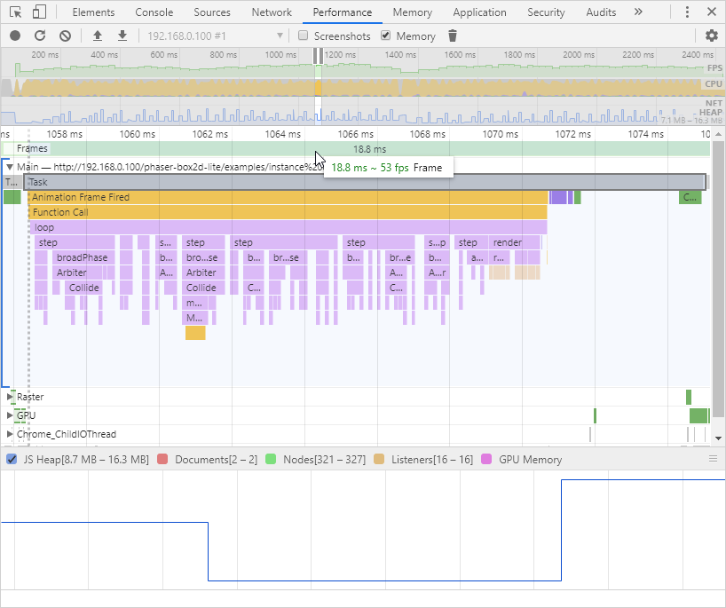

# Box2D Lite TypeScript

This is a port of Erin Catto's [Box2D Lite](https://github.com/erincatto/box2d-lite) to TypeScript.


## v0.0.1

All classes ported. Test bed created. Everything runs, but it's generating a staggering number of vec2 and mat22 instances per frame. Currently, the test is creating 274,000 vec2s and 37,000 mat22s per frame at 20 world iterations. This needs sorting. Inline math to the rescue.

20 world iterations:

```
Frame: 200 = 201,806 vec2s - 36,926 mat22s
Frame: 600 = 274,009 vec2s - 37,007 mat22s
```

10 world iterations:

```
Frame: 200 = 190,846 vec2s - 36,929 mat22s
Frame: 600 = 226,913 vec2s - 37,007 mat22s
```

All tests from now will use 10 iterations.

Note that the totals are how many _brand new_ vec2 and mat22 instances are created
in that one single frame. I.e. used purely for collision math.

Why frames 200 and 600? Because in Frame 200 most of the bodies are in the air, the only contacts are with each other or the pendulum. By Frame 600 they're all resting on the floor, so have lots of contacts.

Here is a performance monitor flamechart capture of a single frame (frame 200):



As you can see, we're already over our frame budget at 18.8ms (53fps) and the heap space fluctuates wildly. The callstack isn't much better:


We've a lot of work to be done tidying this up.

## v0.0.2

Inlined all of the Mat22 static functions.

```
Frame: 200 = 64,448 vec2s - 36,933 mat22s
Frame: 600 = 97,684 vec2s - 36,999 mat22s
```

Much better! That's a 66.2304% decrease on Frame 200 in vec2s. The mat22s still fluctate per frame, though. The more contacts, the more there are, so clearly we need to look at the Collision function soon.

## v0.0.3

ComputeIncidentEdge clipVertex inline:

```
Frame: 200 = 64,224 vec2s - 36,933 mat22s
Frame: 600 = 97,196 vec2s - 36,999 mat22s
```

Barely any change, just a 0.347567% decrease.

## v0.0.4

ComputeIncidentEdge n / abs n inline:

```
Frame: 200 = 64,112 vec2s - 36,877 mat22s
Frame: 600 = 96,952 vec2s - 36,877 mat22s
```

Another really minor gain at a 0.17439% decrease.

## v0.0.5

Inline mat22 and vec2s in CanvasRenderer:

```
Frame: 200 = 62,460 vec2s - 36,772 mat22s
Frame: 600 = 95,300 vec2s - 36,772 mat22s
```

Getting there. The renderer really shouldn't add anything! And now it doesn't. A 2.57674% decrease.

## v0.0.6

Let's break-down which part of the `World.step` is causing the most creations:

| Step                                 | vec2 - frame 200 | vec 2 - frame 600 | mat22 - frame 200 &amp; 600 |
|--------------------------------------|------------------|-------------------|-----------------------------|
| World.broadphase                     | 48,065           | 49,225            | 36,764                      |
| Integrate forces                     | 48,368           | 49,528            | 36,764                      |
| Arbiters preStep                     | 48,928           | 51,368            | 36,764                      |
| Joints preStep                       | 48,937           | 51,377            | 36,772                      |
| Perform aribter and joint iterations | 62,357           | 95,197            | 36,772                      |
| Integrate velocities                 | 62,460           | 95,300            | 36,772                      |

So, for vec2s the majority happen in `World.broadphase` and then a massive jump when performing arbiter and joint iterations.

For mat22s everything pretty much happens in `World.broadphase`.

Let's try and reduce the number of vec2s created during arbiter iterations by inlining a bunch of that math.

## v0.0.7

Inlined all vector math in `Arbiter.applyImpulse` and found some duplicate code:

```
Frame: 200 = 50,210 vec2s - 36,772 mat22s
Frame: 600 = 53,998 vec2s - 36,772 mat22s
```

This is a 19.6126% decrease on Frame 200 and a massive 43.3389% decrease on Frame 600. Lovely.

Let's check our `World.step` stats again:

| Step                                 | vec2 - frame 200 | vec 2 - frame 600 |
|--------------------------------------|------------------|-------------------|
| World.broadphase                     | 48,163           | 49,287            |
| Integrate forces                     | 48,466           | 49,590            |
| Arbiters preStep                     | 49,138           | 51,446            |
| Joints preStep                       | 49,147           | 51,455            |
| Perform aribter and joint iterations | 50,107           | 53,895            |
| Integrate velocities                 | 62,460           | 53,998            |

At this stage, it doesn't matter if the bodies are in contact or not, we're getting a much more steady count.

## v0.0.8

When the test starts-up there are 533 vec2 instances and 7 mat22 instances, this is before the World has even stepped once, so it's just what the bodies, joints, etc need to exist.

`World.broadphase` is clearly the biggest cost here because of the Collide function.

It creates 4 new vec2s _per_ Contact instance. Let's see if we can get that lower.

Ok, after replacing the Contact vec2s with numbers and inlining a load of Arbiter math, we've got:

```
Frame: 200 = 48,236 vec2s - 36,772 mat22s
Frame: 600 = 48,666 vec2s - 36,772 mat22s
```

This is a 3.93149% decrease on Frame 200 and 9.87444% decrease on Frame 600.

## v0.0.9

Have gone through the Collide function and used a set of 7 locally cached Mat22 instances and added a few modifier functions that operate on existing instances. Also cached all vec2 instances in the same function. The end result speaks for itself:

```
Frame: 200 = 684 vec2s - 8 mat22s
Frame: 600 = 866 vec2s - 8 mat22s
```

This is a 98.582% decrease on Frame 200 and 98.2205% decrease on Frame 600 for vec2s, and a huge 99.9782% decrease for the mat22s :)

Pretty happy with just 8 mat22s in the entire test! We're still creating ~700 vec2s per frame, though. That is well within an acceptable range, but it'd be good to see if we can push this any further down.

## v0.1.0

It would appear that the final bastion is the `ClipVertex` class. It only creates one vec2 instance per class, but we can still do away with it perfectly easily, with minimal changes elsewhere. Let's go...

```
Frame: 200 = 535 vec2s - 8 mat22s
Frame: 600 = 535 vec2s - 8 mat22s
```

We've now got the vec2 instance count perfectly stable, regardless of the number of contacts, which is great.

Also, a 38.2217% decrease is pretty good. But, I'm sure we can go further without mangling the code too much.

## v0.2.0

Let's check to see where these instances are coming from in the `World.step` again:

| Step                                 | vec2 - frame 200 &amp; 600 |
|--------------------------------------|----------------------------|
| World.broadphase                     | 0                          |
| Integrate forces                     | 303                        |
| Arbiters preStep                     | 303                        |
| Joints preStep                       | 312                        |
| Perform aribter and joint iterations | 432                        |
| Integrate velocities                 | 535                        |

Both Frames 200 and 600 are identical now.

Clearly, the biggest jump is from the integration of the forces. We also get another jump from joints. I've not touched the Joints class yet, so this isn't surprising. Let's inline the forces first, we could probably use a few cache vars in the World class to achieve this.

After inling the force integration on the bodies:

| Step                                 | vec2 - frame 200 &amp; 600 |
|--------------------------------------|----------------------------|
| World.broadphase                     | 0                          |
| Integrate forces                     | 0                          |
| Arbiters preStep                     | 0                          |
| Joints preStep                       | 9                          |
| Perform aribter and joint iterations | 129                        |
| Integrate velocities                 | 232                        |

Perfect, let's do the same for the velocity integration:

| Step                                 | vec2 - frame 200 &amp; 600 |
|--------------------------------------|----------------------------|
| World.broadphase                     | 0                          |
| Integrate forces                     | 0                          |
| Arbiters preStep                     | 0                          |
| Joints preStep                       | 9                          |
| Perform aribter and joint iterations | 129                        |
| Integrate velocities                 | 129                        |

There, we've eliminated the instance creation during velocity integration. At the end of this version we're now at:

```
Frame: 200 = 129 vec2s - 8 mat22s
Frame: 600 = 129 vec2s - 8 mat22s
```

A healthy 75.8879% decrease over the previous version.

The final part has to be looking at the joints, as these are the only thing causing creation now. Onwards ...

## v0.3.0

Recoded the Joints class to use some local cached vars for immediate math functions, managed to get the stats down to this:

```
Frame: 200 = 0 vec2s - 0 mat22s
Frame: 600 = 0 vec2s - 0 mat22s
```

Yup! Not one single new vec2 or mat22 instance is being created during a `World.step` now. A bit of an improvement from the 274,009 we had at the start of the day :) All math has been either inlined or moved to cached instances. Performance speaks for itself, too.

The test case creates a total of 529 vec2s and 3 mat22s when the simulation starts-up (after creating 103 bodies and a joint). Each body has 4 vec2s, which accounts for 412 of them. Joints have 6 and the rest are created by the classes as cache vars.

To be honest, the Body class could remove 1 (the `width` property), to be swapped for `width` and `height` numbers, which would make more sense anyway.

The Joint class has a whole bunch it doesn't really need and it'd be worth investigating further what could be removed.

Here is a performance monitor flamechart capture of a single frame (frame 200):


Much better! the heap is almost half the size, our frame rate is a solid 60fps and our callstack is equally cleaner:


Clearly, the Mat22 transpose method is eating-up a bit, as is the creation of new Contacts, but this is a dramatic improvement over what we started with and leaves us in a good place to move to the next version. After all, a 100% reduction in instance creation is about as good as you can get :)
